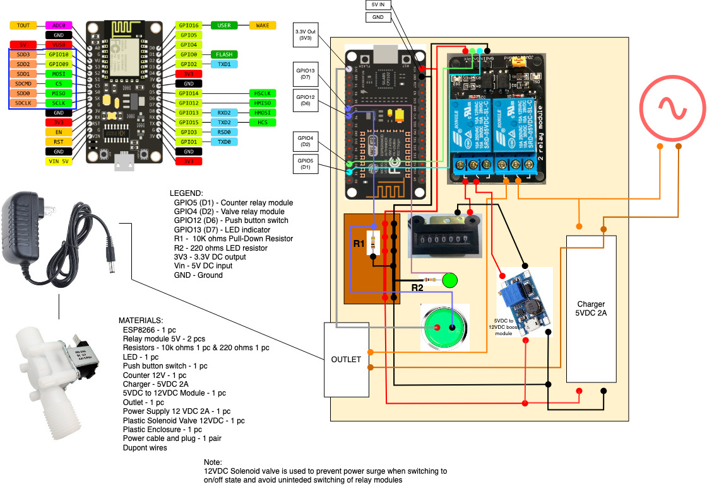
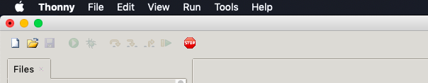
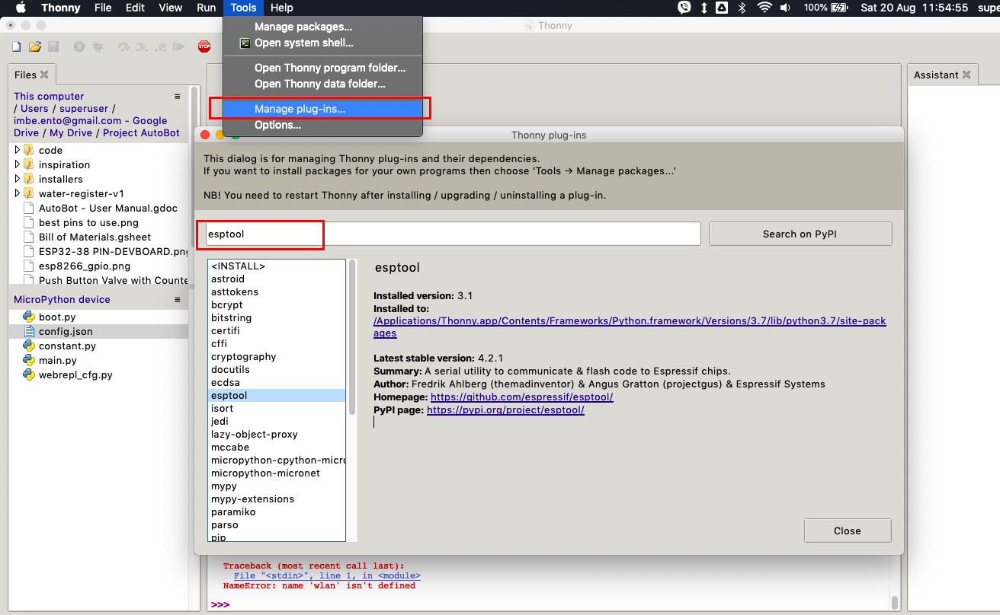
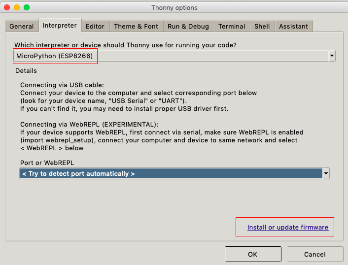
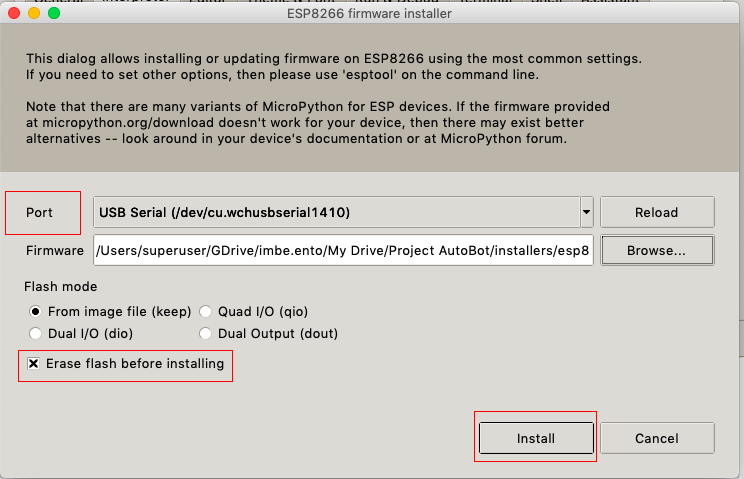

# Water Register v1
For Water Refilling Station Owners. Registers dispensed water to a counter. 

## Usage

1. Pressing the push-button switch closes the counter relay module and the valve relay module.
2. When the valve relay module is closed, it energizes the solenoid valve 12-VDC power supply and water is then dispensed for a period in seconds equivalent to the time a 5-gallon container is full - approximately 66 seconds.
3. When the counter relay module is closed for 0.2 sec, it energizes the counter thus incrementing by one
4. Upon start of water dispensing or container refilling, an indicator LED is lit and turns off once the time is up.
5. The push-button switch can be pressed again to manually stop the dispensing of water.

## Connection Diagram

## Materials

1. Nodemcu ESP8266 v3 - 1 pc
2. Relay module 5V - 2 pcs
3. Resistors - 10k ohms 1 pc & 220 ohms 1 pc
4. LED - 1 pc
5. Push button switch - 1 pc
6. Counter 12V - 1 pc
7. Charger - 5VDC 2A
8. 5VDC to 12VDC Module - 1 pc
9. Outlet - 1 pc
10. Power Supply 12 VDC 2A - 1 pc
11. Plastic Solenoid Valve 12VDC - 1 pc
12. Plastic Enclosure - 1 pc
13. Power cable and plug - 1 pair
14. Heat shrinkable tube
15. Dupont wires
16. Soldering iron and lead
  
## Installation

1. Install the ESP8266 driver

    - CH340 USB-UART chip: [Windows](http://www.wch-ic.com/downloads/CH341SER_EXE.html) [Linux](http://www.wch-ic.com/downloads/CH341SER_LINUX_ZIP.html) [Mac](http://www.wch-ic.com/downloads/CH341SER_MAC_ZIP.html) [Sparkfun](https://learn.sparkfun.com/tutorials/how-to-install-ch340-drivers/all#drivers-if-you-need-them)

    - CP2104 chip: [Silabs](https://www.silabs.com/developers/usb-to-uart-bridge-vcp-drivers)

2. Download and install [Python 3](https://www.python.org/downloads/)

3. Download the firmware from <https://micropython.org/download/?port=esp8266> and click the appropriate firmware. For this we should download [ESP8266 with 2MiB + flash](https://micropython.org/download/esp8266)

4. Flash the firmware to ESP8266

    - Using esptool.py
        - Check the COM port value from Windows device manager
        - Install esptool.py
            - Command: pip3 install esptool
        - Check flash size and other information
            - Command: esptool.py --chip ***<esp8266|esp32>*** --port ***<serial_com_port>*** flash_id
        - Erase the flash memory; While connected to your PC. Press the “BOOT/FLASH” button on your ESP8266 board and run the command
            - Command: esptool.py --chip esp8266 --port <serial_com_port> erase_flash
        - Flash the Micropython firmware
            - Command: esptool.py --chip esp8266 --port <serial_com_port> write_flash -z 0x1000 <esp8266-X.bin>

    - Using Thonny IDE
        - Press the stop button in Thonny IDE
        
        - Click “Tools” > “Manage plug-ins” , search esptool and install
        
        - Click “Tools” > “Options”, configure settings and click “Install or update firmware”
        
        
5. Copy the files to esp8266 using Thonny IDE
    - main.py
    - constant.py
    - config.json
6. Reset your esp8266

## Additional Info

Please open an issue to discuss what you would like to change or recommend.

## License

[MIT](./LICENSE)

